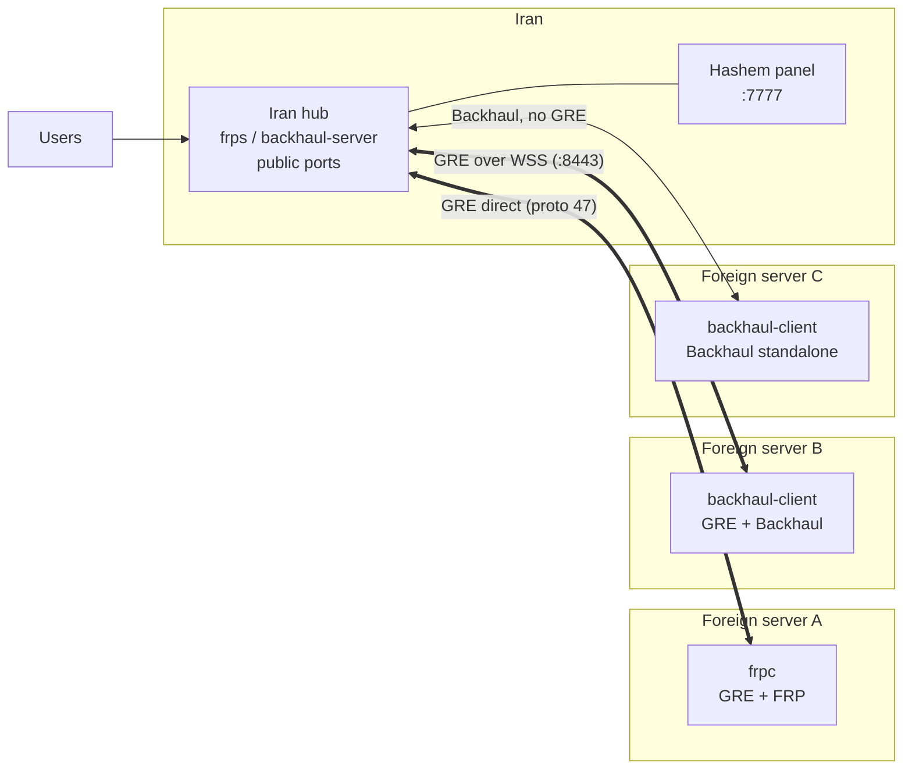

<div align="center">

# DNC MADE THIS

# Hashem Panel 🇮🇷 ↔ 🌍

**A hub-and-spoke tunnel manager: GRE Layer-3 + FRP / Backhaul reverse relay, with a web dashboard, health model, watchdog and safe updates.**

🇬🇧 English | [🇮🇷 فارسی](README.fa.md)

[](https://github.com/pdnczone/hashem-panel/releases/latest)
[](https://github.com/pdnczone/hashem-panel/actions/workflows/build-panel.yml)
[](https://github.com/pdnczone/hashem-panel/actions/workflows/security.yml)
[](https://github.com/pdnczone/hashem-panel)
[](https://www.gnu.org/licenses/agpl-3.0)

[🌐 Website](https://pdnczone.ir) · [✈️ Telegram](https://t.me/pdnczone) · [▶️ YouTube](https://youtube.com/@pdnczone)

*Keep the real servers hidden — expose foreign-server ports through the public IP of your Iran server.*

</div>

---

## Table of contents

- [What is Hashem?](#what-is-hashem)
- [Features](#features)
- [Architecture](#architecture)
- [Quick install](#quick-install)
- [Panel tour](#panel-tour)
- [Tunnel types](#tunnel-types)
- [Health model](#health-model)
- [Automation](#automation)
- [Updates, downgrade and channels](#updates-downgrade-and-channels)
- [`hashem` CLI](#hashem-cli)
- [Documentation map](#documentation-map)
- [Security notes](#security-notes)
- [License](#license)

---

## What is Hashem?

Hashem is a tunnel manager made of two parts:

- **The installer / CLI** — `hashem.sh` (installed as `hashem`), plus `hashem-backhaul.sh` and `hashem-chaff.sh`. It sets up GRE, FRP and Backhaul services with systemd.
- **The panel** — a Go backend with a single-page web UI (`gre-panel`). It runs on every server and shows the tunnel, peers, health, latency, logs, diagnostics and updates.

The model is a **hub and spokes**:

- The **Iran hub** is the server in Iran. It runs `frps` / the Backhaul server and the panel, and it owns the public ports that users connect to.
- Each **foreign server** is a spoke. It runs `frpc` / the Backhaul client and dials the hub. Traffic that arrives on the hub is relayed to the foreign server.
- Several foreign servers can be attached to one hub. The peer limit defaults to 10 and is read from the `GRE_MAX_PEERS` environment variable.

---

## Features

- 🚀 **One-line install** — prebuilt standalone Go binary from official GitHub releases.
- 🧩 **Three tunnel engines** — `GRE+FRP`, `GRE+Backhaul`, and `Backhaul` standalone (no GRE).
- 🛰️ **Two GRE carriers** — Direct GRE (IP protocol 47) and WSS (TLS WebSocket, port `8443` by default).
- 🔌 **FRP transports** — `tcp`, `kcp`, `quic`, `websocket`, `wss`, with payload encryption, compression and PROXY Protocol v2. See the [FRP Transports Guide](docs/FRP_TUNNELS_GUIDE.md).
- 📦 **Setup bundles** — one string carries keys, IPs, transport and ports: `hsh1_…` (FRP), `bh1_…` (Backhaul), `gh1_…` (GRE+Backhaul). Paste it on the foreign server and the form fills itself.
- 🔀 **Port management** — single ports (`443`), lists (`80,443`), ranges (`1000-1010`) and mappings (`8080=80`).
- 🩺 **One health model everywhere** — the Dashboard banner, fleet cards and topology graph use the same rules.
- ⏱️ **Latency per link and hub average** — ICMP first, kernel TCP RTT as fallback.
- 🔁 **Dial route** — foreign servers can dial the hub over the GRE inner IP or its public IP, with automatic fallback.
- 🐕 **Watchdog** — runs every minute from a systemd timer; optional Telegram alerts.
- 🔄 **Safe updates** — stable / dev channels, install any of the last 20 releases (upgrade or downgrade), SHA-256 verification, config backup, automatic rollback.
- 🎯 **Carrier benchmark** and **diagnostics** (`hashem doctor`).
- 💻 **In-browser terminal** — disabled by default, audited.
- 🛡️ **DPI Shield and traffic chaff** — optional obfuscation and rate-limiting.
- 🔒 **Hardened panel** — SHA-256 password hashes, NIST 800-63B password policy, CSRF tokens, trusted-proxy handling, audit log. See [Security notes](#security-notes).

---

## Architecture



Inside a GRE link, the relay (FRP or Backhaul) normally runs over the GRE inner addresses. If the GRE path is dead, the foreign side can dial the hub's public IP instead (see [Health model](#health-model) and [Automation](#automation)).

How one public connection travels:

```mermaid
sequenceDiagram
    participant User
    participant Hub as Iran hub
    participant Link as GRE / WSS / Backhaul link
    participant Srv as Foreign server
    Srv->>Hub: relay client dials the control port
    User->>Hub: connects to a public port
    Hub->>Link: forwards through the relay
    Link->>Srv: delivers to the local service
    Srv-->>User: reply travels back the same way
```

---

## Quick install

Run the same one-liner on **both** servers. It is `install.sh` from this repository: it downloads `hashem.sh`, installs it as `/usr/local/bin/hashem`, and starts it.

```bash
bash <(curl -fsSL https://raw.githubusercontent.com/pdnczone/hashem-panel/main/install.sh)
```

1. **On the Iran server** — run the command and choose option `1`. Choose the engine, carrier and ports. The installer prints a **setup bundle** (for example `hsh1_…`). Copy it.
2. **On the foreign server** — run the command and choose option `2`. Paste the bundle; the tunnel and services are configured automatically.
3. **Open the panel** — the end of the install prints the secure panel URL (`http://<server-ip>:7777/<secret>`) and the first admin credentials. The password is not stored in plaintext; save it. Reset it any time with `hashem reset-password`, or CLI menu option `3 -> 2`.

Adding more foreign servers: use the **Setup** tab in the panel or `hashem add-peer` / `hashem add-backhaul-peer` on the hub, then paste the new bundle on the new foreign server.

---

## Panel tour

See the [documentation map](#documentation-map) for the available guides.

### Dashboard — the overall state

The top banner shows one big word (Healthy / Degraded / Down) and one line per tunnel. Below it are the KPIs and the Fleet Health card with the hub latency summary, the topology graph and per-server cards.


### Tunnel — the main tunnel and its peers

Manage the main tunnel and the foreign-server peer cards.


### Performance — tuning

Capacity, encryption/compression, chaff and DPI Shield.


**FRP TCP Multiplexing (`transport.tcpMux`) is OFF by default** (speed-first: tcpMux roughly halves throughput over GRE). New `frps`/`frpc` configs are written with `transport.tcpMux = false`. Turn it on only deliberately with `hashem perf tcpmux on` (or the Performance tab). The setting **must be identical on the Iran hub and every foreign spoke**; a mismatch makes `frpc` fail to log in with `connect to server error: EOF`, and `hashem status` / `hashem doctor` print a hint when they see it. Backhaul is unaffected.

### Diagnostics — latency, jitter, MTU


### Traffic charts


### Other tabs

- **Setup** — pairing, bundles and peers
- **Watchdog** — monitoring and alerts
- **Benchmark** — carrier probing
- **Update** — channels, install any tag
- **Logs, Settings, Terminal**

---

## Tunnel types

- **GRE+FRP** (`frp`) — a GRE Layer-3 link between the two servers with FRP running over it. FRP transports: `tcp`, `kcp`, `quic`, `websocket`, `wss`. `wss` needs a TLS front: a `frps-wss*.service` unit running `gre-panel tls-proxy` on `control_port+2`. Guide: [FRP transports guide](docs/FRP_TUNNELS_GUIDE.md).
- **GRE+Backhaul** (`gre-backhaul`) — the same GRE link, with Backhaul as the relay. Bundle prefix `gh1_`.
- **Backhaul standalone** (`backhaul`) — Backhaul only, no GRE interface at all. Bundle prefix `bh1_`.
- **Carriers for the GRE layer** — **Direct GRE** (IP protocol 47) and **WSS** (TLS WebSocket, default `:8443`). The FOU carrier was removed.

---

## Health model

The same rule is used by the Dashboard banner, the fleet cards and the topology graph (`fleetHealth` in `panel/fleet.go`). Per tunnel:

- **Healthy** — (GRE up **and** FRP up **and** ICMP ping ok) **or** (FRP service up **and** the foreign client holds an ESTABLISHED TCP session on the control port — called *linked*).
- **Degraded** — exactly one leg up (GRE or FRP) and no linked session; or both up but no ping and not linked.
- **Down** — nothing up.
- **"FRP only" badge** — linked, but the GRE inner address does not answer ICMP: traffic still flows over FRP while the GRE path is blocked.

*Linked* is detected with `ss -Htn state established` on the control port (also `port+2` for the wss front and `port-2`).

The dashboard's overall status uses the same function. The main tunnel counts as one more spoke of the hub (synthetic id `0`, named `Tunnel · <ip>`).

**Latency** per link is taken in this order: (1) ICMP ping of the GRE inner address → kind `icmp`; (2) if ICMP fails, the kernel TCP RTT of the live session on the control port (from `ss -tin`) → kind `tcp`; (3) otherwise `—`. The hub summary (`/api/fleet` → `latency`) gives avg, min, max over links that have a value, the count, and how many are `icmp` vs `tcp`. History, sparkline, average, loss and uptime use the same value.

---

## Automation

- **Watchdog** — a systemd timer (`hashem-watchdog.timer`) runs `hashem watchdog tick` every minute. Control it with `hashem watchdog on|off|status|test|tick`. Telegram alerts are configured in the watchdog settings; `hashem tgsend "msg"` sends a manual message.
- **Dial route** — on foreign servers, `hashem dial [status|auto|gre|public]` chooses whether `frpc` / `backhaul-client` dials the hub over the GRE inner IP or the hub public IP. `auto` uses GRE if it answers (ping or TCP to the control port), otherwise public. The watchdog switches to public automatically when GRE is dead and the client is not connected. Foreign servers show a "Route to the Iran hub" card.
- **Carrier failover** — `hashem carrier` manages and cycles carriers.
- **Backups** — `hashem backup now|restore|schedule|status` (encrypted archives in `/var/backups/hashem`).
- **Adaptive capacity** — multiplexing capacity adjusts to load and available RAM.

---

## Updates, downgrade and channels

The **Update** tab (and `hashem update` for the script + panel) uses two channels:

- **`stable`** — GitHub releases that are *not* prerelease (tags `panel-rN` and `vX.Y.Z`).
- **`dev`** — prereleases tagged `dev-rN`, built from the `dev` branch.

The channel is stored in `<configDir>/update.json` (`GET/POST /api/update/channel`). `GET /api/releases?channel=stable|dev` lists the last 20 releases of a channel. You can install **any listed tag**, newer or older — that is how you downgrade (`POST /api/update {"tag":"panel-r140"}`; without a tag, the newest of the selected channel).

Install steps: validate tag → download the panel binary and `hashem.sh` of that tag → verify SHA-256 from that tag's `checksums.txt` (fail-closed) → verify ELF / `bash -n` → back up the config dir to `<configDir>/backups/pre-<from>-<timestamp>.tar.gz` (last 5 kept; `exe.bak` and `hashem.sh.bak` kept) → swap → write `<configDir>/pending_update.json` → restart.

**Auto-rollback:** the new process counts its starts in `pending_update.json`. If it crashes 3 times before it is confirmed healthy (self health check 45 s after start), the old binary and `hashem.sh` are restored and the panel restarts.

**Branches:** `main` is stable (a push that changes `panel/**` or `hashem*.sh` builds release `panel-r<run>`); `dev` is for testing (each push builds prerelease `dev-r<run>`, never offered on stable). Promote by a manual Pull Request `dev → main`. Hotfix: branch from `main`, PR to `main`, then merge `main` back into `dev`.

---

## `hashem` CLI

Everything works from SSH too (commands as in `hashem` usage):

```bash
hashem                # first run: auto-install; afterwards shows panel credentials
hashem menu           # interactive management menu
hashem status         # tunnel health, peers, service status
hashem reset-password # reset / auto-generate the admin password
hashem password <p>   # set the panel password non-interactively
hashem logs           # relay logs
hashem optimize       # BBR / MTU / sysctl tuning
hashem doctor         # latency, jitter, MTU and speed diagnostics
hashem carrier        # carrier management / failover
hashem dial status    # foreign side: route to the Iran hub
hashem watchdog status
hashem backup now     # encrypted backup (/var/backups/hashem)
hashem chaff on       # traffic obfuscation (idle-gap filler)
hashem dpi-shield on  # rate-limit reverse ports
hashem free-ram       # free RAM
hashem update         # update script and panel to the latest release
hashem uninstall      # full wipe
```

---

## Documentation map

- Guides — [Secure deployment](docs/DEPLOYMENT.md) · [FRP transports guide](docs/FRP_TUNNELS_GUIDE.md) (Persian + English)
- Policy — [SECURITY.md](SECURITY.md)

---

## Security notes

- **Policy and disclosure:** [SECURITY.md](SECURITY.md).
- **Production deployment** (Nginx / Caddy, TLS, firewall, `TRUSTED_PROXY_IPS`): [docs/DEPLOYMENT.md](docs/DEPLOYMENT.md).
- Passwords are stored only as SHA-256 hashes in `/etc/gre-panel/panel.json`; the policy requires 12+ characters with upper, lower, number and symbol.
- State-changing requests need a session-bound HMAC-SHA256 `X-CSRF-Token`; `X-Forwarded-For` is trusted only from `TRUSTED_PROXY_IPS`.
- Updates are pinned to official GitHub domains and verified with SHA-256 from `checksums.txt`; the installer script is checked with `bash -n`.
- The in-browser terminal is **disabled by default** and audited (10-minute idle and 30-minute absolute limits).
- Security events are written to `/etc/gre-panel/security-audit.log`.

---

## License

Licensed under the **GNU Affero General Public License v3.0 (AGPL-3.0)**. If you modify this software and run it as a network service, you must make your modifications available under the same license. See [LICENSE](LICENSE).

## Community

- 🌐 [pdnczone.ir](https://pdnczone.ir) · ✈️ [@pdnczone](https://t.me/pdnczone) · ▶️ [@pdnczone](https://youtube.com/@pdnczone)

Issues and Pull Requests are welcome.
